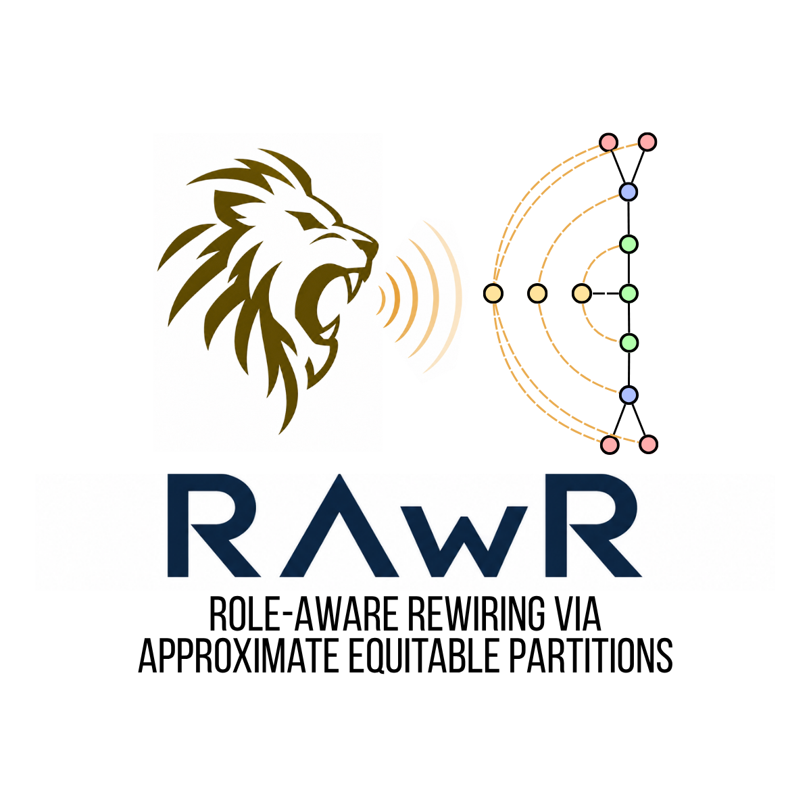

# RAwR: Role-Aware Rewiring via Approximate Equitable Partitions

<p align="center">
  
</p>

This repository contains the reproducibility material for the paper <a href="https://arxiv.org/abs/2605.09457">RAwR: Role-Aware Rewiring via Approximate Equitable Partition</a>.

This methods aims at improving long-range propagation in GNNs by adding in the graphs virtual nodes assigned to nodes belonging to the same block of an Approximate Equitable Partition.


## Setup

Run commands from this folder (the folder containing this README):

```bash
python3 -m venv .venv
source .venv/bin/activate
pip install -r requirements.txt
```


## Reproduce experiments

### 1) RAwR sweeps (GCN/GAT/GIN + RepNodes/RepEdges)

```bash
python3 scripts/run_experiments.py --skip-lp
```

Output:

- `results/node_classification_results.csv`

### 2) Random partition comparison

```bash
python3 scripts/run_random_partition_baseline.py --skip-lp
```

Output:

- `results/random_partition_node_classification.csv`

### 3) Competitor suite (JDR/BORF/FOSR/SDRF/ComFy/TRIGON)

```bash
python3 scripts/run_competitor_suite.py
```

Outputs:

- `results/competitors_rewiring_methods.csv` (unified table; all methods as peers)
- `results/competitors_comfy_trigon_raw_node_classification.csv` (raw trial-level export for ComFy/TRIGON)

### 4) GRAIN and GRAIN+RAwR

```bash
python3 scripts/run_grain_suite.py
```

Outputs:

- `results/grain_none_yes_features.csv`
- `results/grain_rep_nodes_yes_features.csv`
- `results/grain_rep_edges_yes_features.csv`

### 5) Resistance metrics (total + mean effective resistance)

```bash
python3 src/resistance.py --output results/resistance_results.csv
python3 src/resistance_latex.py --csv results/resistance_results.csv > results/resistance_tables.tex
```

Outputs:

- `results/resistance_results.csv`
- `results/resistance_tables.tex`

### 6) SRL

```bash
python3 spectral/srl_main.py --out results/srl_results.csv
```

Output:

- `results/srl_results.csv`

### 7) SRL*

```bash
python3 spectral/build_cyhmn_srlstar_table.py
```

Outputs:

- `results/cyhmn_srlstar_metrics.csv`
- `results/cyhmn_srlstar_selected_eps.csv`
- `results/cyhmn_srlstar_summary.csv`
- `results/gcn_cyhmn_rewiring_comparison.tex`

### 8) Synthetic teacher-student

```bash
python3 spectral/cyhmn_teacher_student_experiment.py
```

Outputs:

- `results/cyhmn_teacher_student_results.csv`
- `results/cyhmn_srl_vs_mse.png`

## One-command orchestration

Full pipeline:

```bash
python3 scripts/run_all_repro.py
```

Quick smoke run:

```bash
python3 scripts/run_all_repro.py --quick
```

Subset run:

```bash
python3 scripts/run_all_repro.py --sections rawr,random,competitors,grain,resistance,srl,srlstar,teacher_student
```

## Cite this work

```text
@misc{porcedda2026rawrroleawarerewiringapproximate,
      title={RAwR: Role-Aware Rewiring via Approximate Equitable Partition}, 
      author={Riccardo Porcedda and Giuseppe Squillace and Bastian Epping and Andrea Vandin and Michael Schaub and Mirco Tribastone and Francesca Chiaromonte},
      year={2026},
      eprint={2605.09457},
      archivePrefix={arXiv},
      primaryClass={cs.LG},
      url={https://arxiv.org/abs/2605.09457}, 
}
```